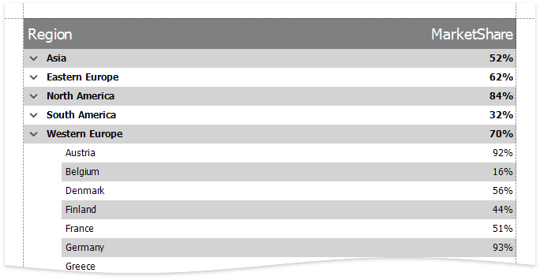

# How to create a Hierarchical Report in Code

> Refer to the [Create a Hierarchical Report](https://docs.devexpress.com/XtraReports/400925/create-popular-reports/create-a-hierarchical-report) topic to learn how to create a hierarchical report in the Report Designer.

Steps to create a hierarchical report in code:

## Bind Report to Data

You can print a report in tree mode if it is bound to recursive data or data with ID-ParentID related fields. In this example, data records are defined by the **SalesData** class. See the **GetDataSource** method to learn how this class' **RegionID** and **ParentRegionID** properties build a hierarchy. This method returns a list of data records for the report's [DataSource](https://docs.devexpress.com/XtraReports/DevExpress.XtraReports.UI.XtraReportBase.DataSource).

## Specify Hierarchy Print Options

Specify either the [HierarchyPrintOptions.ChildListFieldName](https://docs.devexpress.com/XtraReports/DevExpress.XtraReports.UI.HierarchyPrintOptions.ChildListFieldName) property (for recursive data) or the [HierarchyPrintOptions.KeyFieldName](https://docs.devexpress.com/XtraReports/DevExpress.XtraReports.UI.HierarchyPrintOptions.KeyFieldName)-[HierarchyPrintOptions.ParentFieldName](https://docs.devexpress.com/XtraReports/DevExpress.XtraReports.UI.HierarchyPrintOptions.ParentFieldName) property pair (for ID-ParentID related data fields, like in this example) to print the report's [DetailBand](https://docs.devexpress.com/XtraReports/DevExpress.XtraReports.UI.DetailBand) in three mode.

Specify the [HierarchyPrintOptions.Indent](https://docs.devexpress.com/XtraReports/DevExpress.XtraReports.UI.HierarchyPrintOptions.Indent) property to specify the child node offset, in [report units](https://docs.devexpress.com/XtraReports/DevExpress.XtraReports.UI.XtraReport.ReportUnit).

## Align Tree Nodes

In this example, the [AnchorHorizontal](https://docs.devexpress.com/XtraReports/DevExpress.XtraReports.UI.XRControl.AnchorHorizontal) property of the DetailBand's labels is set to *Both* and *Right*. This allows the labels to fit the page. See the [HierarchyPrintOptions](https://docs.devexpress.com/XtraReports/DevExpress.XtraReports.UI.HierarchyPrintOptions) class description for details.

## Add a Control to Expand/Collapse Tree Nodes

Do the following to allow end users to expand and collapse tree nodes:

1. Add the [XRCheckBox](https://docs.devexpress.com/XtraReports/DevExpress.XtraReports.UI.XRCheckBox) control to the DetailBand at the left-most position.
	In this example, the checkbox' [GlyphOptions](https://docs.devexpress.com/XtraReports/DevExpress.XtraReports.UI.XRCheckBox.GlyphOptions) property is used to specify custom glyphs for the *checked* and *unchecked* states.
	
2. Set the DetailBand's [DrillDownControl](https://docs.devexpress.com/XtraReports/DevExpress.XtraReports.UI.DetailBand.DrillDownControl) property to the added XRCheckBox control.

3. Set the XRCheckBox's [CheckState](https://docs.devexpress.com/XtraReports/DevExpress.XtraReports.UI.XRCheckBox.CheckState) property to the following expression: [ReportItems].[Detail].[DrillDownExpanded] 

## Sort Report Data

In this example, the DetailBand's [SortFields](https://docs.devexpress.com/XtraReports/DevExpress.XtraReports.UI.DetailBand.SortFields) property is specified to sort data on each hierarchy level.

## Highlight Root Nodes

When the **CurrentRowHierarchyLevel** variable in [expressions](https://docs.devexpress.com/XtraReports/120104/detailed-guide-to-devexpress-reporting/use-expressions/expression-constants-operators-and-functions#variables-for-event-related-expressions) to get a row's zero-based level in the tree. In this example, this variable is used in the DetailBand's expression to print the root tree nodes in bold.

